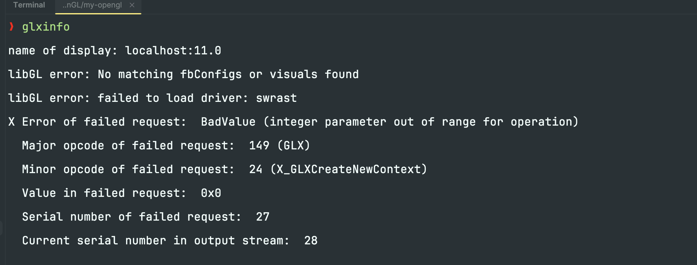
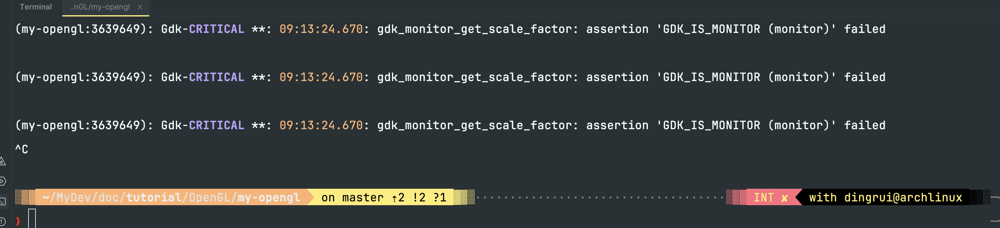

ISSUE
---

新手上车踩坑

### 1 glxinfo检测OpenGL本机版本

- 有可能是宿主机没有安装显卡驱动(amd)

  - [AMD Ryzen 7735HS的驱动只有windows版本的](https://www.amd.com/zh-hans/support/apu/amd-ryzen-processors/amd-ryzen-7-processors-radeon-graphics/amd-ryzen-7-7735hs)

### 2 gdk_monitor_get_scale_factor

