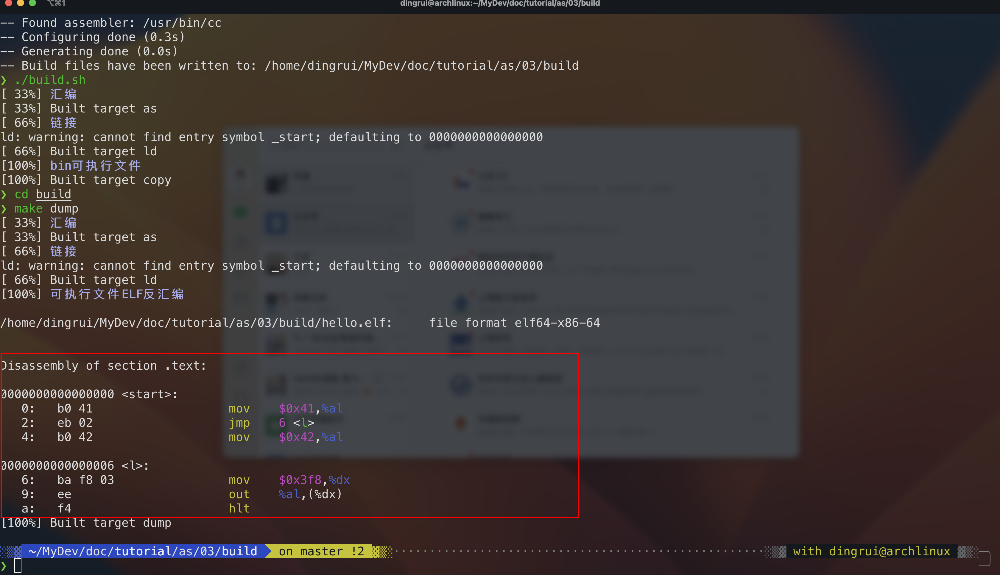

汇编
---

以AT&T语法为例，我个人比较喜欢这个风格

### 1 基础

汇编语言程序由若干汇编指令组成，一条x86汇编指令基本格式如下

`标签:助记符 操作数1, 操作数2, 操作数3`

其中

- 标签 这一部分可选，用于标识指令的地址。通常用于控制指令流，比如jmp指令后面可以跟一个标签，表示跳转到标签标识的指令处

- 助记符 这部分是指令操作码的符号表示，用于帮助记忆指令，是指令中必不可少的部分

- 操作数 x86的汇编指令支持0到3个操作数，具体数量依赖于具体的指令。操作数之间用逗号分隔，操作数通常分别称为源操作数和目的操作数

### 2 格式

AT&T代码语法风格

- 源操作数在左，目的操作数在右

- 寄存器前面需要使用符号%

- 立即数加$

- 没有加$的数字的操作数表示的是内存地址

汇编程序每条语句占据一行，大小写不敏感，一般使用小写字母形式

### 3 指令

#### 3.1 伪指令

在汇编程序中，所有伪指令都是以.开头的。所谓伪指令，并不会被翻译为处理器执行的机器指令，只是程序员给汇编器的一些指示。

- .text 告知汇编器接下来这是代码段

- .code16 告知汇编器目标处理器是16位的，生成16位系统运行的的汇编代码。如果不使用.code16那么汇编器会把当前执行汇编指令的计算机当作目标系统，比如说系统是64位的，就会将其生成64位目标代码

- .org 定位到相对代码起始地址的一个偏移处，具体偏移量由org后面的参数给出

- .byte 

- .word

- .global 告知汇编器将函数定义为全局可见的符号，否则函数只在当前文件内可见，链接器链接时会找不到符号

#### 3.2 out

有2个操作数

- 源操作数为累加寄存器，根据源操作数位数分别使用AL、AX或者EAX，存储向串口发送的内容

- 目的操作数表示外设端口地址

  - 当端口地址小于256时，目的操作数可以直接使用8位立即数

  - 否则目的操作数用寄存器，比如DX，存储外设端口地址

#### 3.3 mov

将数据载到寄存器中

不支持直接将立即数写到段寄存器ES中，需要通过寄存器BX进行中转

- 源操作数

  - 立即数以$开头的数字

  - 不是以$开头的数据表示的内存地址 表示mov指令从`CS<<4+数字`这个内存地址上读取数据放到目的操作数

- 目的操作数 寄存器宽度判断从内存中读取多大的数据

  - AL寄存器 8bit=1byte 表示mov指令从内存读取1个byte数据放到AL寄存器

#### 3.4 hlt

告诉处理器停止运行

#### 3.5 jmp

jmp指令的操作数寻址方式

jmp指令通过修改指令指针，控制处理器下一次读取指令的地址，从而实现跳转的目的

jmp想要实现向前跳转，一定需要增加IP的值，那么增加多少呢

如下为objdump反汇编的elf可执行文件

jmp指令本身在偏移2处，当处理器从内存中读取了jmp指令后，处理器会更新IP的值以指向下一条指令，也就是IP会等于4

但是现在是要向前跳到偏移6处，所以IP还需要增加2个字节

偏移2处的jmp指令机器码是`eb 02`，eb是jmp的操作码，02就是IP要增加的值

#### 3.6 栈

栈就是一段连续的内存区域，栈有自己专有的段，栈段的基址存储在段寄存器SS中

多任务系统中，每个任务都有自己的栈，否则不同的任务就会发生冲突，因此系统中同时存在多个栈，但在同一时刻，只有一个栈可用，SS指向当前栈段的基址，SP指向当前栈的栈顶

x86架构，栈从高地址向低地址方向增长，数据段从低地址向高地址方向增长，所以通常程序会将栈底设置在高内存处，给栈和数据预留充足的空间

- push 执行push指令时 处理器首先递减寄存器SP 为压入数据腾出空间 然后将数据写入栈的新顶部

- pop 执行pop指令 处理器首先从栈顶读取数据 然后递增寄存器SP

每次执行push和pop指令时压栈出栈多少字节呢

每次压栈出栈支持

- 1word

- 2word

- 4word

不同处理器支持的位宽不同

- 32位和64位处理器支持上面3中宽度

- 16位处理器只支持1个字和2个字的宽度

16位系统，默认压入的是1个word，即16bit

push指令和pop指令根据操作数的宽度决定压栈出栈是1个字还是2个字

#### 3.7 call

实现函数调用

- 首先将指令指针的值入栈

- 修改指针指针为被调用函数的第一条指令地址，实现到被调用函数的跳转

#### 3.8 ret

被调用函数执行ret指令

从栈顶弹出返回地址到指令指针寄存器，这样就把程序控制流转移到了调用函数的返回地址

### 4 汇编和链接

编写完汇编程序后，需要将其翻译为机器指令，将汇编程序翻译为机器指令过程包含2步

- 汇编 汇编会将汇编程序翻译为处理器认识的机器码，汇编器翻译后的输出称为目标代码(object code)，包含目标代码的文件称为目标文件

- 链接 目标代码需要经过链接过程生成处理器可以运行的代码，对应的文件称为可执行文件

linux中负责汇编的工具为as，负责链接的工具为ld

- as 汇编 `as hello.s -o hello.o`

- ld 链接 `ld -Ttext=0 hello.o -o hello.elf`

事实上，经过汇编和链接后，生成的目标文件是ELF格式的，其除了存储代码和数据部分外，还记录了其他信息，比如段的信息、符号表和调试信息等

- objdump 反汇编将机器码还原为汇编指令 `objdump -d -m i8086 hello.elf`

  - 选项-d是disassemble首字母，告诉objdump进行反汇编

  - 选项-m i8086表示体系结构是16位的8086

- hexdump 将文件内容原封不动显示出来 `hexdump -C hello.elf`

- objcopy 操作目标文件，将ELF文件中的代码和数据部分复制出来，这个没有任何格式的文件称为binary文件 `objcopy -O binary hello.elf hello.bin`

### 5 示例

- [01 屏幕输出字符A](./01)

- [02 显式设置操作数的段寄存器](./02/README.md)

- [03 立即数寻址](./03/README.md)

- [04 直接寻址](./04/README.md)

- [05 ModR/M寻址](./05)

- [06 SIB寻址](./06)

- [07 SIB+disp寻址](./07)

- [08 选择](./08)

- [09 循环](./09)

- [10 栈](./10)

- [11 函数及x86调用](./11/README.md)

- [12 BP寄存器](./12)

- [13 多模块](./13)

- [14 栈传递参数](./14/README.md)

- [15 寄存器传递参数](./15/README.md)

- [16 局部变量](./16/README.md)

- [17 返回值及参数清理](./17/README.md)
