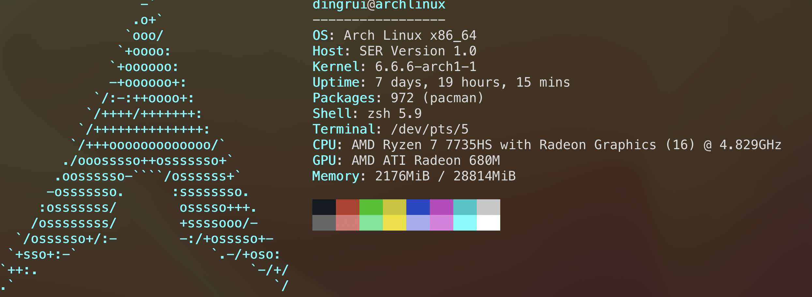

一个64位操作系统的设计与实现
---

### 1 开发环境

### 2 开发命令

#### 2.1 编译器和编译工具

- gcc

- as GAS汇编器，编译AT&T格式汇编

- ld 链接器，将编译文件链接成可执行文件

- cmake

- make

#### 2.2 系统工具

- dd 复制指定大小的数据块，并在复制过程中转换数据格式

- mount 挂载，将U盘、软盘、光驱等存储设备挂载到指定路径

- umount 卸载

- sync 数据同步，将已缓存的数据回写到存储设备上

- objdump 反汇编

- objcopy 文件提取

### 3 Bochs虚拟机

[见这篇博客](https://bannirui.github.io/2024/02/28/archlinux%E7%BC%96%E8%AF%91bochs/)

### 4 编码

> 书里面用的是Intel风格代码，我自己比较偏爱AT&T

- [01 写一个软盘Boot引导程序](./01)

- [02 创建虚拟软盘镜像文件](./02)

- [03 在Bochs上运行Boot程序](./03)