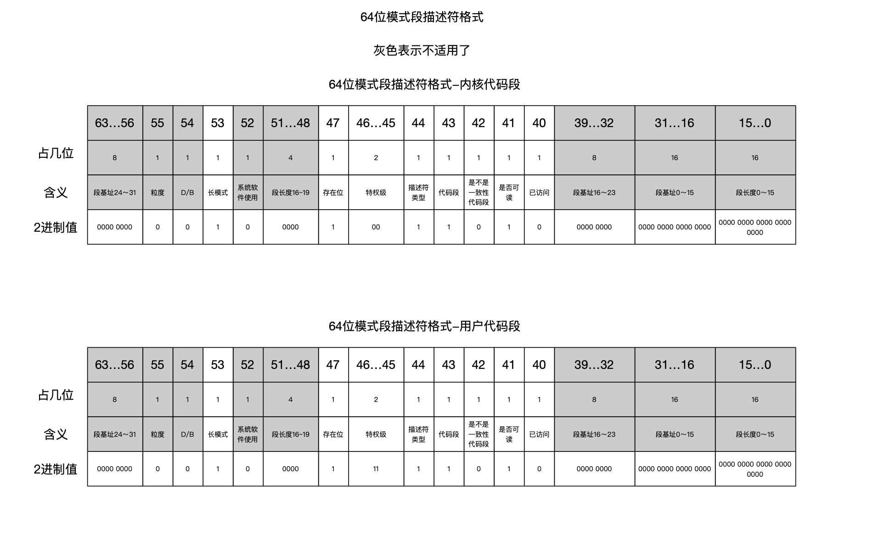
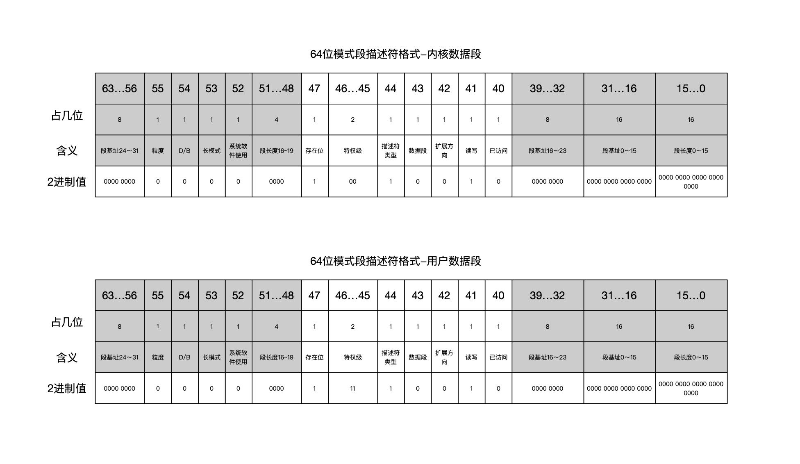
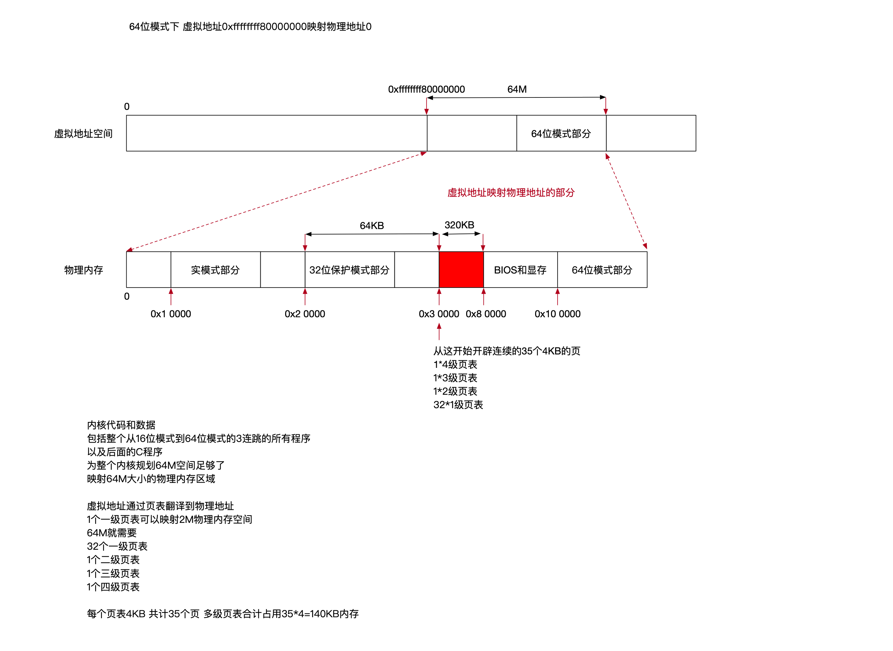

64位引导过程
---

### 1 内存分页

64位模式下，处理器使用页式寻址

#### 1.1 为什么要分页

- 页式内存管理从逻辑上把内存等分成页，以页位单位管理内存，程序运行时以页位单位按需加载即可

- 使用分页模式后，一旦出现内存紧张，发生内存和硬盘交换的情况时，可以不必将内存中程序的整段都交换出去，只需将必要的页面交换出去，通常内核会选择最近最少使用的页面

- 因为内存块大小一致，内存碎片也消失了

#### 1.2 分页模式下的地址翻译过程

使用了分页机制后，每次访问内存

- MMU(内存管理单元)中的段单元首先开始工作

  - 段单元首先从段描述符表寄存器GDTR中读取段描述符表的地址，根据段寄存器中的索引从段描述符表中索引到具体的段描述符

  - 从段描述符中取出段的基址，加上偏移地址计算出一个内存地址，称为虚拟地址

- 然后MMU的页单元开始工作

  - 页单元从寄存器CR3中取出页表基址

  - 根据页表将线性地址翻译为物理地址

#### 1.3 程序的虚拟地址空间

在分页模式下，每个程序的虚拟地址构成了自己的虚拟地址空间

在平坦模型下，段基址为0，段的长度为最大可寻址的地址，程序的虚拟地址空间就是处理器的整个可寻址空间

虚拟地址的每一个虚拟地址都通过程序自己的页表映射到具体的物理地址，页表由位于特权级0的内核管理，确保了不同程序彼此之间不会越界访问

通过虚拟内存机制，多个进程之间可以和平共享物理内存，每个进程都有自己独立的虚拟地址空间，感觉就像自己独占物理内存一样

每个进程有自己独立的页表，通过页表，完成虚拟地址到物理地址的映射

不同进程的虚拟地址到具体物理地址的映射，由内核统筹分配

进程有了自己的独立页表后，在某一个进程中访问任何地址时都不可能访问到另一个进程的数据

#### 1.4 分页模式下的寻址

页面大小4k

计算机存储粒度是byte，也就是说1个页面可以存4096个byte，4096=1<<12，那么寻址页内地址需要使用12位，即页内偏移需要占据12位

如果页面存的是地址，即页表项是指针，1个指针64位，8byte，那么1个页表可以放512个8byte的指针，512=1<<9，也就是说需要9位就可以索引一个页表中512项

64位x86使用虚拟地址中的低48位寻址，并且将48位线性地址划分为4个9位用于索引页表项，剩余的12位勇于4KB的页内偏移

4级页表的虚拟地址如下

- [47...39] 四级页表索引

- [38...30] 三级页表索引

- [29...21] 二级页表索引

- [20...12] 一级页表索引

- [11...0] 页内偏移

MMU内存管理单元将虚拟地址翻译为物理地址步骤如下

- MMU首先从寄存器CR3中取出四级页表的基址

- MMU提取虚拟地址的39~47位，索引四级页表中的页表项，从中取出三级页表的基址

- MMU提取虚拟地址30～38位，索引三级页表中的页表项，从中取出二级页表的基址

- MMU提取虚拟地址21～29位，索引二级页表中的页表项，从中取出一级页表的基址

- MMU提取虚拟地址12～20位，索引一级页表中的页表项，从中取出物理页帧的基址

- MMU提起虚拟地址0~11位，作为物理页帧的业内偏移，将其与页帧的基址相加，计算出具体的物理地址

在地址翻译过程中，如果页表项不存在，则表示这个页表项指向的下一级页表尚未分配，MMU会抛出页面异常(page fault)

处理器收到异常后，会调用内核中的页面异常处理函数，分配页表，填充页表项，简历虚拟地址到物理地址的映射关系

### 2 64位模式下程序的虚拟地址空间

- 内核代码和数据占据的虚拟地址以及运行时使用的各种地址构成的地址空间称为内核空间

- 用户程序中的指令和数据占据的空间以及程序运行时使用的各种地址构成的地址空间称为用户空间

linux系统将内核空间分配在高地址部分，将用户空间分配在低地址部分

系统运行时，通过页表将虚拟地址映射到物理内存中应用程序或内核对应的指令

### 3 创建64位模式的临时段描述符表

64位x86几乎禁用了分段机制，不再从段描述符中获取段基地址、段长度

但是处理器还是依据段描述符中的字段决定其运行模式及特权级，所以还是需要准备段描述符

#### 3.1 代码段

#### 3.2 数据段

#### 3.3 为64位模式创建临时段描述符表

处理器运行在32位保护模式下，为了切入64位模式，需要为64位准备段描述符表

但是进入64位模式之后，保护模式部分的gdtr和gdt内存地址将不可寻址，我们需要在进入64位模式之后创建一个新的全局段描述符表

因此这个支撑从32位过渡到64位的段描述符表是一个临时表，在过渡期间内核不会进入用户空间，因此临时表中只需要内核代码段和内核数据段描述符就足够了

准备好段描述符表之后，需要告知处理器使用这个新的段描述符表，再次使用指令lgdt重新装载段寄存器GDTR

### 4 建立内核映像的虚拟地址到物理地址的映射

### 5 建立恒等映射

### 6 切入64位模式

### 7 走进内核64位部分